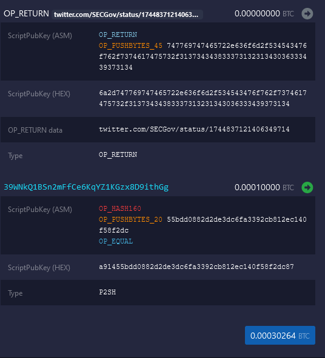

# bitcoinlib RPC
Use your locally hosted Bitcoin node (like Umbrel) and bitcoinlib in Python to create a wallet and send `OP_RETURN` message in a Bitcoin transaction.
Linux ( tested in WSL2 Ubuntu on one machine and umbrel bitcoin node on your local network like a Raspiberry Pi )

<p align="center">
  
</p>

https://mempool.space/tx/aceee291b364905098aa28019c6521b9941daa1104772bad358e1334e1bd19a7

## Overview

- Create a new wallet and generate a text file with wallet name, public address, and private key.
- Modify Python files to add your details.
- Run a curl command to test RPC connection to your node.
- Send a small amount of funds to your new wallet to cover the outgoing transaction and fees.
- Run a script to get updated info about your wallet.
- Run a script to send a transaction with your message.
- Check the block explorer with the TXID to see your message.

## Installation and Setup

- Install Python 3.10 (3.11 might work but is untested). You can create a conda environment with Python 3.10.4.
- Install bitcoinlib: `pip install bitcoinlib`
- Install required dependencies: `sudo apt install build-essential python3-dev libgmp3-dev`

### Create Wallet

- Open `create_test_wallet.py` and change the wallet name at the bottom (avoid spaces).
- Run `python create_test_wallet.py`
- You will get a `.txt` file with wallet details, including the private key in WIF format.

### Set Environment Variables

Added your details and run the following to your terminal or you can add the secrets to your `.bashrc`
If using umbrel or similar select bitcoin node, connect, RPC local network credintials

```bash
export BITCOIN_NODE_HOST='your_node_ip'
export BITCOIN_NODE_PORT='your_node_port'
export BITCOIN_RPC_USERNAME='your_rpc_username'
export BITCOIN_RPC_PASSWORD='your_rpc_password'
export MY_BTC_PRIVATE_KEY='your_private_key_here'
```

### Configure Bitcoin RPC Connection in bitcoinlib

- Edit ~/.bitcoinlib/bitcoin.conf and add your details:

```bash
[rpc]
rpcconnect=192.168.x.xx
rpcport=8332
rpcuser=umbrel
rpcpassword=XXXXXXXXXXXXXXXXXXXXXXXXXX
txindex=1
server=1
```

### Test RPC Connection

- Run the following curl command to check if the RPC connection is working (fill in your username, password, IP, and port):

```bash
curl --user rpc_user_name:rpc_password --data-binary '{"jsonrpc": "1.0", "id":"curltest", "method": "getblockchaininfo", "params": [] }' -H 'content-type: text/plain;' http://ip:port/
```

### Fund Your Wallet

- Send funds to your new wallet's public address (from the .txt file).
- Wait for confirmations on a block explorer or run `python wallet_scan_details.py` (enter the correct wallet name inside file).

### Prepare and Send Transaction

- Open btcmessage_rpc.py
- Add your wallet name, public address, sender's address, fee, sending amounts, and your message (less than 80 bytes).
- Run the script to send your transaction when ready.

Run `python btcmessage_rpc.py`  This script uses the wallet you created in bitcoinlib, gets it up to date with UTXOs, creates the transaction, extracts the raw transaction hex, and then sends it to your Bitcoin node for broadcasting. If successful, you will see the TXID and the raw transaction hex.

Copy your TXID and paste it in a block explorer like Mempool https://mempool.space/ to see your OP_RETURN message and details.


## Disclaimer

This project is for educational purposes only. The use of the code, scripts, and information provided is at your own risk. Cryptocurrency transactions are irreversible, and incorrect handling or misuse of wallet details (such as private keys) can result in permanent loss of funds. Always double-check your transactions and test with small amounts before proceeding with larger transactions. Additionally, be mindful of the security risks when handling private keys and accessing Bitcoin nodes. This guide assumes a certain level of technical proficiency and understanding of cryptocurrency transactions and blockchain technology.

## Credits 

https://github.com/1200wd/bitcoinlib

Bitcoin and other Cryptocurrencies Library for Python. Includes a fully functional wallet, Mnemonic key generation and management and connection with various service providers to receive and send blockchain and transaction information.
bitcoinlib.readthedocs.io/ 


